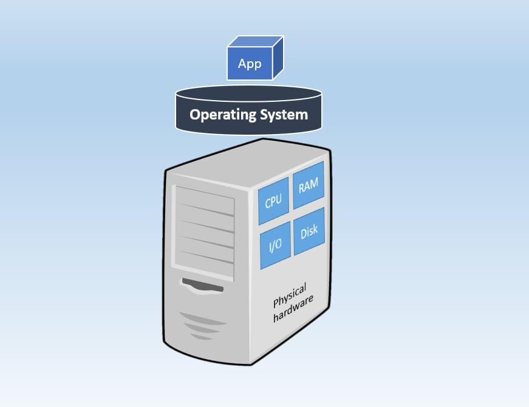
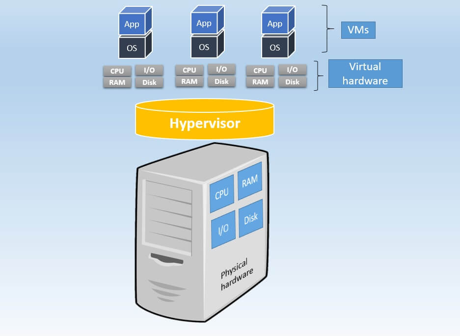
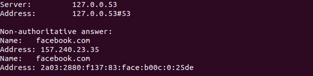

## Physical Machine vs Virtual Machine



A physical machine is a single-tenant computer machine meaning that a specific physical machine is designated to a single user. The resources and components of a physical machine are not shared between multiple users. Each physical machine includes memory, processor, network connection, hard drive, and an operating system (OS) for running programs and applications.





A virtual machine (VM) is a software computer used as emulation of an actual physical computer. A virtual machine operates in a “multi-tenant” environment, meaning that multiple VMs run on the same physical hardware. In this case, the computing resources of a physical server are virtualized and shared among all VMs running on it. The architecture of a virtual server is a little more complex than that of a physical server. Thus, a hypervisor is installed on top of physical hardware. A hypervisor is then used to create and manage VMs, which have their own virtual computing resources. After that, you can load multiple guest OSes and server applications on top of the virtual hardware. Thus, virtual servers allow you to run several OSes and applications on the basis of the shared physical hardware, which makes it a more cost-effective option than a physical server.


## OSI model

The Open Systems Interconnection (OSI) model describes seven layers that computer systems use to communicate over a network. It helps network device manufacturers and networking software vendors: Create devices and software that can communicate with products from any other vendor, allowing open interoperability.


 The important layers are 

 **Application Layer  :**

  At the very top of the OSI Reference Model stack of layers, we find Application layer which is implemented by the network applications. These applications produce the data, which has to be transferred over the network. Applications such as  Browsers, facebook works in this layer.

**Transport Layer  :**

   It is responsible for the End to End Delivery of the complete message. The data in the transport layer is referred to as Segments.
   This layer adds Sender and Receiver’s port number.

**Network Layer :**

  Network layer works for the transmission of data from one host to the other located in different networks. Segment in Network layer is referred as Packet. This layer adds Sender and Receiver’s IP address.Routers are device of this layer.

**Data Link Layer (DLL) :** 

  The data link layer is responsible for the node to node delivery of the message. DLL also encapsulates Sender and Receiver’s MAC address in the header. The Receiver’s MAC address is obtained by placing an ARP(Address Resolution Protocol) request onto the wire asking “Who has that IP address?” and the destination host will reply with its MAC address. Switch & Bridge are Data Link Layer devices.

**Physical Layer :**

   The lowest layer of the OSI reference model is the physical layer. It is responsible for the actual physical connection between the devices. The physical layer contains information in the form of bits. Hub, Repeater, Modem, Cables are Physical Layer devices.

## Domain Name Server

It translates Internet domain and host names to IP addresses and vice versa. DNS technology allows to type names into Web browser like www.facebook.com  and computer to automatically find that address on the Internet. 

nslookup (name server lookup) is a tool used to perform DNS lookups in Linux. It is used to display DNS details, such as the IP address of a particular computer,

```bash
nslookup facebook.com
```
After applying this command



## NIC

A network interface card (NIC) is a hardware component without which a computer cannot be connected over a network. It is a circuit board installed in a computer that provides a dedicated network connection to the computer.


## Socket

Socket is an interface between an application process and transport layer.A socket is bound to a port number so that the TCP layer can identify the application that data is destined to be sent to. The application process can send/receive messages to/from another application process (local or remote)via a socket.

## DHCP (Dynamic Host Configuration Protocol) 

DHCP (Dynamic Host Configuration Protocol) is a network management protocol used to dynamically assign an Internet Protocol (IP) address to any device, or node, on a network so they can communicate using IP. DHCP automates and centrally manages these configurations rather than requiring network administrators to manually assign IP addresses to all network devices. DHCP can be implemented on small local networks, as well as large enterprise networks.

## Browser sender port selection while establishing TCP connection

  A TCP connection consists of two endpoints, and each endpoint consists of an IP address and a port number. Therefore, when a client user connects to a server computer, an established connection can be thought of as the 4-tuple of (server IP, server port, client IP, client port).

  Usually three of the four are readily known -- client machine uses its own IP address and when connecting to a remote service, the server machine's IP address and service port number are required.
  What is not immediately evident is that when a connection is established that the client side of the connection uses a port number. Unless a client program explicitly requests a specific port number, the port number used is an ephemeral port number.

  An ephemeral port is a temporary communication hub used for Internet Protocol (IP) communications. It is created from a set range of port numbers by the IP software and used as an end client's port assignment in direct communication with a well-known port used by a server.
  After communication is terminated, the port becomes available for use in another session. However, it is usually reused only after the entire port range is used up.

  Different operating systems (OS) use different port ranges for ephemeral ports. Many Linux versions use port range 32768-61000, while Windows versions (until XP) use 1025-5000, by default.
  Later Windows versions, including Vista, Windows 7 and Server 2008, use the Internet Assigned Number Authority (IANA) suggested range of 49152-65535.


## Collision Domain vs Broadcast Domain

A collision domain refers to a network scenario whereby one device sends a frame out on a physical network segment, thus forcing every other device on the same segment to pay attention to the information sent out.This scenario is not good in anyway – it is actually a problem when we look at it closely. The challenge comes in when two devices on the same network segment send data at the same time – a collision will occur, which forces the devices to resend the information.

Unlike collision domains, a broadcast domain is created when a group of computers are connected to the same network segment, making them listen to any broadcast message that is sent on the network segment.

So, which of our network devices break collision domains and which of them break broadcast domains? 

**HUB**

It neither breaks a collision domain nor a broadcast domain,i.e a hub is neither a collision domain separator nor a broadcast domain separator. All the devices connected to a hub is in a single collision and single broadcast domain.
    
**SWITCH**

Coming to switches, we have an advantage over the hub. Every port on a switch is in a different collision domain, i.e a switch is a collision domain separator. So messages that come from devices connected to different ports never experience a collision. This helps us during designing networks but there is still a problem with switches. They never break broadcast domains, means it is not a broadcast domain separator. All the ports on the switch are in still in a single broadcast domain. If a device sends a broadcast message, it will still cause congestion.

**ROUTER**

A router not only breaks collision domains but also break broadcast domains, means it is both collision as well as broadcast domain separator. A router creates a connection between two networks. A broadcast message from one network will never reach the other one as the router will never let it pass. 

## CIDR

CIDR, which stands for Classless Inter-Domain Routing, is an IP addressing scheme that improves the allocation of IP addresses. It replaces the old system based on classes A, B, and C.
CIDR is based on variable-length subnet masking (VLSM). This allows it to define prefixes of arbitrary lengths making it much more efficient than the old system. CIDR IP addresses are composed of two sets of numbers. The network address is written as a prefix, like you would see a normal IP address (e.g. 192.255.255.255). The second part is the suffix which indicates how many bits are in the entire address (e.g. /12). Putting it together, a CIDR IP address would look like the following:

192.255.255.255/12

The network prefix is also specified as part of the IP address. This varies depending upon the number of bits required. Therefore, taking the example above, we can say that the first 12 bits are the network part of the address while the last 20 bits are for host addresses.


## Configuring an IP address on a switch

By default, Cisco switches forward Ethernet frames without any configuration. This means that you can buy a Cisco switch, plug in the right cables to connect various devices to the switch, power it on, and the switch will work properly.

However, to perform switch management over the network or use protocols such as SNMP, the switch will need to have an IP address. The IP address is configured under a logical interface, known as the management domain or VLAN. Usually, the default VLAN 1 acts like the switch’s own NIC for connecting into a LAN to send IP packets.

 Here are the steps to configure an IP address under VLAN 1:

  1. enter the VLAN 1 configuration mode with the interface vlan 1 global configuration command. 
  2. assign an IP address with the ip address IP_ADDRESS SUBNET_MASK interface subcommand. 
  3. enable the VLAN 1 interface with the no shutdown interface subcommand. 
  4. (Optional) use the ip default-gateway IP_ADDRESS global configuration command to configure the default gateway. 
  5. (Optional) Add the ip name-server IP_ADDRESS global configuration command to configure the DNS server.


